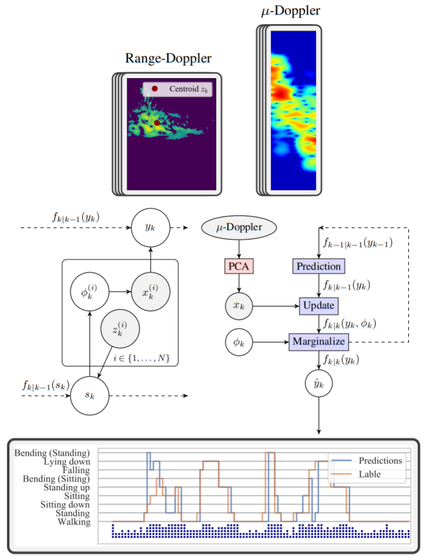

# radar-Bayesian-human-motion
  

This repo contains the codebase of the method and results presented in 

    A Bayesian model of human motion as observed by a radar network

with abstract

    In this paper, a statistical model of human motion as observed by a network of radar sensors is presented where knowledge on the position and heading of the target provides information on the observation conditions of each sensor node. Sequences of motions are estimated from measurements of instantaneous Doppler frequency, which captures informative micro-motions exhibited by the human target. A closed-form Bayesian estimation algorithm is presented that jointly estimates the state of the target and its exhibited motion class. It is shown, by modeling sensor observation conditions and by isotonic calibration of the measurement likelihood, that a cognitive resource management system is able to increase classification accuracy by 5--10 % while utilizing sensor resources in accordance with defined mission objectives.

For reproducability the processed dataset is here released in ./data/datset_df which is a serialized pandas dataframe. 2 GB of unprocessed data has been here released through git LFS.

# Installation
Run 
    pip install -r requirements.txt

# Usage

To reproduce the results presented in the paper run

    python train.py --no-rebuild

To run the complete signal processing pipeline from the partial unprocessed data run

    python train.py --rebuild
